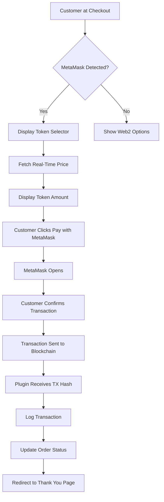
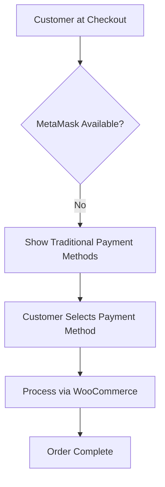

# GOLDT Web3 Hybrid Payments


**Professional Web3 Hybrid Payment Gateway for WooCommerce**

A complete, modular WordPress + WooCommerce plugin that enables:
- 🦊 **Web3 payments with MetaMask**
- 💳 **Web2 traditional payments as fallback**
- 🔮 **Integration with GOLDT off-chain oracle**
- 🪙 **Support for GOLDT ecosystem tokens**
- 🏗️ **Clean, documented, and extensible architecture**

## 🎯 Overview

GOLDT Web3 Hybrid Payments allows your WooCommerce store to accept cryptocurrency payments directly through MetaMask while maintaining traditional payment options as a fallback. The plugin integrates with the GOLDT oracle for real-time token pricing and supports the complete GOLDT ecosystem.

### Key Features

- ✅ **Automatic MetaMask Detection** - Seamlessly detects and integrates with customer wallets
- ✅ **Multi-Token Support** - GOLDT, GOLDVE, BNBV, GPOOL, FGVAULT tokens
- ✅ **Real-Time Pricing** - Live price conversion via GOLDT oracle API
- ✅ **Multi-Chain** - Ethereum, BSC, Polygon support
- ✅ **Transaction Logging** - Complete transaction history and management
- ✅ **Web2 Fallback** - Traditional payment methods when Web3 is unavailable
- ✅ **Professional Admin Panel** - Easy configuration and management
- ✅ **100% GPL** - Fully open source and compliant
- ✅ **WordPress Standards** - Follows WordPress Coding Standards
- ✅ **Secure** - Nonces, sanitization, and validation throughout

## 📋 Requirements

- **WordPress**: 5.8 or higher
- **WooCommerce**: 5.0 or higher
- **PHP**: 7.4 or higher
- **MetaMask**: Browser extension (for customers)

## 🚀 Installation

### Automatic Installation

1. Log into your WordPress admin panel
2. Navigate to **Plugins → Add New**
3. Search for "GOLDT Web3 Hybrid Payments"
4. Click **Install Now** and then **Activate**

### Manual Installation

1. Download the plugin ZIP file
2. Navigate to **Plugins → Add New → Upload Plugin**
3. Choose the ZIP file and click **Install Now**
4. Activate the plugin

### From Source

```bash
cd wp-content/plugins
git clone https://github.com/edson1ve/goldt-web3-hybrid-payments.git
```

## ⚙️ Configuration

### Basic Setup

1. Navigate to **WooCommerce → Settings → Payments**
2. Click on **GOLDT Web3 Hybrid Payments**
3. Configure the following:

#### Essential Settings

- **Enable Plugin**: Check to enable the payment gateway
- **Wallet Address**: Your cryptocurrency wallet address (where payments will be received)
- **Blockchain Network**: Select your network (BSC, Ethereum, Polygon)
- **Allowed Tokens**: Select which tokens customers can use

#### Oracle Settings

- **Oracle Endpoint**: `https://goldt.criptoinversiones.net/api/rates.php` (default)
- **Cache Duration**: Time to cache rates in seconds (default: 60)

#### Advanced Settings

- **Web3 Enabled**: Enable MetaMask payments
- **Web2 Fallback**: Enable traditional payment methods
- **Payment Status**: Order status after successful payment

### Token Configuration

The plugin comes pre-configured with GOLDT ecosystem tokens:

| Token | Symbol | Network | Type |
|-------|--------|---------|------|
| GOLDT Token | GOLDT | BSC | ERC-20 |
| GOLDVE Token | GOLDVE | BSC | ERC-20 |
| BNBV Token | BNBV | BSC | ERC-20 |
| GPOOL Token | GPOOL | BSC | ERC-20 |
| FGVAULT Token | FGVAULT | BSC | ERC-20 |

#### Adding Custom Tokens

You can add custom tokens through the admin interface or programmatically:

```php
$tokens_manager = GOLDT_Tokens::get_instance();
$tokens_manager->add_custom_token(array(
    'symbol'      => 'CUSTOM',
    'name'        => 'Custom Token',
    'decimals'    => 18,
    'contract'    => '0x...',
    'chain_id'    => 56,
    'type'        => 'ERC20',
    'logo'        => 'https://...',
    'description' => 'My custom token',
));
```

## 🔄 Payment Flow

### Web3 Payment Flow



### Web2 Fallback Flow



## 🏗️ Architecture

### Plugin Structure

```
goldt-web3-hybrid-payments/
│
├── goldt-web3-hybrid-payments.php    # Main plugin file
├── readme.txt                         # WordPress.org readme
├── README.md                          # This file
├── uninstall.php                      # Cleanup on uninstall
│
├── /includes                          # Core PHP classes
│   ├── class-goldt-loader.php        # Hook loader
│   ├── class-goldt-admin.php         # Admin functionality
│   ├── class-goldt-frontend.php      # Frontend display
│   ├── class-goldt-web3.php          # Web3 integration
│   ├── class-goldt-oracle.php        # Oracle API handler
│   ├── class-goldt-tokens.php        # Token management
│   ├── class-goldt-woocommerce.php   # WooCommerce gateway
│   └── helpers.php                    # Helper functions
│
├── /assets                            # Frontend assets
│   ├── /css                          # Stylesheets
│   │   ├── frontend.css              # Frontend styles
│   │   ├── checkout.css              # Checkout page styles
│   │   └── admin.css                 # Admin panel styles
│   ├── /js                           # JavaScript
│   │   ├── web3-handler.js           # MetaMask integration
│   │   ├── frontend.js               # Frontend functionality
│   │   └── admin.js                  # Admin functionality
│   └── /img                          # Images and icons
│
└── /languages                         # Translations
    └── goldt-web3.pot                # Translation template
```

### Class Diagram

```
GOLDT_Web3_Hybrid_Payments (Main)
│
├── GOLDT_Loader                      # Manages hooks
├── GOLDT_Admin                       # Admin panel
├── GOLDT_Frontend                    # Frontend display
├── GOLDT_Web3                        # Web3 handler
├── GOLDT_Oracle                      # Oracle integration
├── GOLDT_Tokens                      # Token manager
└── GOLDT_WooCommerce_Gateway         # Payment gateway
```

## 🔌 REST API Endpoints

The plugin exposes three REST API endpoints:

### 1. Get Price

**Endpoint**: `/wp-json/goldt/v1/get-price`  
**Method**: POST  
**Parameters**:
- `token_symbol` (string, required): Token symbol (e.g., "GOLDT")
- `fiat_amount` (number, required): Amount in fiat currency

**Response**:
```json
{
  "success": true,
  "data": {
    "fiat_amount": 100.00,
    "token_amount": 80.00,
    "token_symbol": "GOLDT",
    "price_usd": 1.25,
    "rate_inverse": 0.8,
    "oracle_timestamp": 1234567890
  }
}
```

### 2. Submit Transaction

**Endpoint**: `/wp-json/goldt/v1/submit-transaction`  
**Method**: POST  
**Parameters**:
- `order_id` (integer, required): WooCommerce order ID
- `tx_hash` (string, required): Transaction hash
- `from_address` (string, required): Customer wallet address
- `token_symbol` (string, required): Token used
- `token_amount` (number, required): Token amount sent

**Response**:
```json
{
  "success": true,
  "transaction_id": 123,
  "explorer_url": "https://bscscan.com/tx/0x...",
  "message": "Payment submitted successfully"
}
```

### 3. Get Tokens

**Endpoint**: `/wp-json/goldt/v1/get-tokens`  
**Method**: GET

**Response**:
```json
{
  "success": true,
  "tokens": [
    {
      "symbol": "GOLDT",
      "name": "GOLDT Token",
      "decimals": 18,
      "contract": "0x...",
      "logo": "https://..."
    }
  ]
}
```

## 🔧 Developer Guide

### Hooks and Filters

The plugin provides several hooks for customization:

#### Actions

```php
// Before processing Web3 payment
do_action('goldt_before_web3_payment', $order_id, $token_symbol);

// After successful payment
do_action('goldt_after_payment_success', $order_id, $transaction_id);

// After transaction logged
do_action('goldt_transaction_logged', $transaction_id, $data);
```

#### Filters

```php
// Modify oracle endpoint
add_filter('goldt_oracle_endpoint', function($endpoint) {
    return 'https://custom-oracle.com/api';
});

// Modify supported tokens
add_filter('goldt_supported_tokens', function($tokens) {
    $tokens['NEWTOKEN'] = array(/* token data */);
    return $tokens;
});

// Modify payment complete status
add_filter('goldt_payment_complete_status', function($status) {
    return 'completed';
});
```

### Custom Token Integration

Example of adding a custom token programmatically:

```php
add_action('init', function() {
    if (class_exists('GOLDT_Tokens')) {
        $tokens = GOLDT_Tokens::get_instance();
        
        $tokens->add_custom_token(array(
            'symbol'      => 'MYTOKEN',
            'name'        => 'My Custom Token',
            'decimals'    => 18,
            'contract'    => '0x1234567890123456789012345678901234567890',
            'chain_id'    => 56, // BSC
            'type'        => 'ERC20',
            'logo'        => 'https://mysite.com/token-logo.png',
            'description' => 'My custom token for payments',
        ));
    }
});
```

### Accessing Oracle Data

```php
// Get current price for a token
$oracle = GOLDT_Oracle::get_instance();
$rate_data = $oracle->get_token_rate('GOLDT');

if (!is_wp_error($rate_data)) {
    echo "Current GOLDT price: $" . $rate_data['price_usd'];
}

// Calculate token amount
$calculation = $oracle->calculate_token_amount(100.00, 'GOLDT');
if (!is_wp_error($calculation)) {
    echo "For $100, you need " . $calculation['token_amount'] . " GOLDT";
}
```

### Transaction Management

```php
// Log a transaction
$transaction_id = goldt_log_transaction(array(
    'order_id'      => 123,
    'tx_hash'       => '0x...',
    'from_address'  => '0x...',
    'to_address'    => '0x...',
    'token_symbol'  => 'GOLDT',
    'amount_fiat'   => 100.00,
    'amount_token'  => 80.00,
    'chain_id'      => 56,
));

// Get transaction by hash
$transaction = goldt_get_transaction_by_hash('0x...');

// Update transaction status
goldt_update_transaction_status($transaction_id, 'completed');
```

## 🛡️ Security

The plugin implements multiple security measures:

- ✅ **Nonce Verification** - All AJAX and form submissions verified
- ✅ **Input Sanitization** - All inputs sanitized using WordPress functions
- ✅ **Output Escaping** - All outputs properly escaped
- ✅ **SQL Injection Prevention** - Prepared statements for all database queries
- ✅ **XSS Prevention** - Proper escaping and sanitization
- ✅ **CSRF Protection** - Nonce-based CSRF protection
- ✅ **Capability Checks** - Admin functions require proper capabilities

### Validation Examples

```php
// Ethereum address validation
$address = goldt_sanitize_eth_address($input);
if (!$address) {
    // Invalid address
}

// Transaction hash validation
$tx_hash = goldt_sanitize_tx_hash($input);
if (!$tx_hash) {
    // Invalid hash
}
```

## 📊 Database Structure

### Transactions Table

```sql
CREATE TABLE wp_goldt_transactions (
    id bigint(20) NOT NULL AUTO_INCREMENT,
    order_id bigint(20) NOT NULL,
    tx_hash varchar(66) NOT NULL,
    from_address varchar(42) NOT NULL,
    to_address varchar(42) NOT NULL,
    token_symbol varchar(20) NOT NULL,
    token_address varchar(42) NOT NULL,
    amount_fiat decimal(20,2) NOT NULL,
    amount_token decimal(30,10) NOT NULL,
    chain_id int(11) NOT NULL,
    oracle_rate decimal(30,10) NOT NULL,
    oracle_timestamp bigint(20) NOT NULL,
    status varchar(20) DEFAULT 'pending',
    created_at datetime DEFAULT CURRENT_TIMESTAMP,
    updated_at datetime DEFAULT CURRENT_TIMESTAMP ON UPDATE CURRENT_TIMESTAMP,
    PRIMARY KEY  (id),
    KEY order_id (order_id),
    KEY tx_hash (tx_hash),
    KEY status (status)
);
```

## 🧪 Testing

### Testing Oracle Connection

```php
$oracle = GOLDT_Oracle::get_instance();
$test_result = $oracle->test_connection();

if ($test_result['success']) {
    echo "Oracle connected successfully!";
    print_r($test_result['data']);
} else {
    echo "Oracle connection failed: " . $test_result['message'];
}
```

### Testing Token Configuration

```php
$tokens = GOLDT_Tokens::get_instance();
$all_tokens = $tokens->get_all_tokens(true); // Get enabled tokens only

foreach ($all_tokens as $symbol => $token) {
    echo "{$token['name']} ({$symbol}): {$token['contract']}\n";
}
```

## 🌐 Internationalization

The plugin is translation-ready. All strings are wrapped in translation functions:

```php
__('Text to translate', 'goldt-web3');
_e('Text to translate and echo', 'goldt-web3');
esc_html__('Text to translate and escape', 'goldt-web3');
```

### Creating Translations

1. Use POEdit or similar tool
2. Load the template from `/languages/goldt-web3.pot`
3. Translate strings
4. Save as `goldt-web3-{locale}.po` and `.mo`
5. Place in `/languages/` directory

## 📝 Logging

The plugin includes comprehensive logging:

```php
// Log informational message
goldt_log('Transaction processed successfully');

// Log warning
goldt_log('Oracle response slow', 'warning');

// Log error
goldt_log('Failed to connect to oracle', 'error');
```

Logs are accessible via WooCommerce → Status → Logs, source: `goldt-web3-hybrid-payments`

## 🤝 Contributing

Contributions are welcome! Please:

1. Fork the repository
2. Create a feature branch (`git checkout -b feature/amazing-feature`)
3. Commit your changes (`git commit -m 'Add amazing feature'`)
4. Push to the branch (`git push origin feature/amazing-feature`)
5. Open a Pull Request

### Coding Standards

- Follow WordPress Coding Standards
- Use proper PHPDoc comments
- Include inline documentation
- Write secure code (sanitize inputs, escape outputs)
- Test thoroughly before submitting

## 📄 License

This plugin is licensed under GPL v2 or later.

```
Copyright (C) 2026 GOLDT Development Team

This program is free software; you can redistribute it and/or modify
it under the terms of the GNU General Public License, version 2, as
published by the Free Software Foundation.

This program is distributed in the hope that it will be useful,
but WITHOUT ANY WARRANTY; without even the implied warranty of
MERCHANTABILITY or FITNESS FOR A PARTICULAR PURPOSE. See the
GNU General Public License for more details.
```

## 📞 Support

- **Documentation**: This README
- **Issues**: https://github.com/edson1ve/goldt-web3-hybrid-payments/issues
- **Website**: https://goldt.criptoinversiones.net

## 🙏 Acknowledgments

- WordPress and WooCommerce teams
- MetaMask team
- GOLDT ecosystem community
- All contributors

---

**Made with ❤️ by the GOLDT Development Team**
